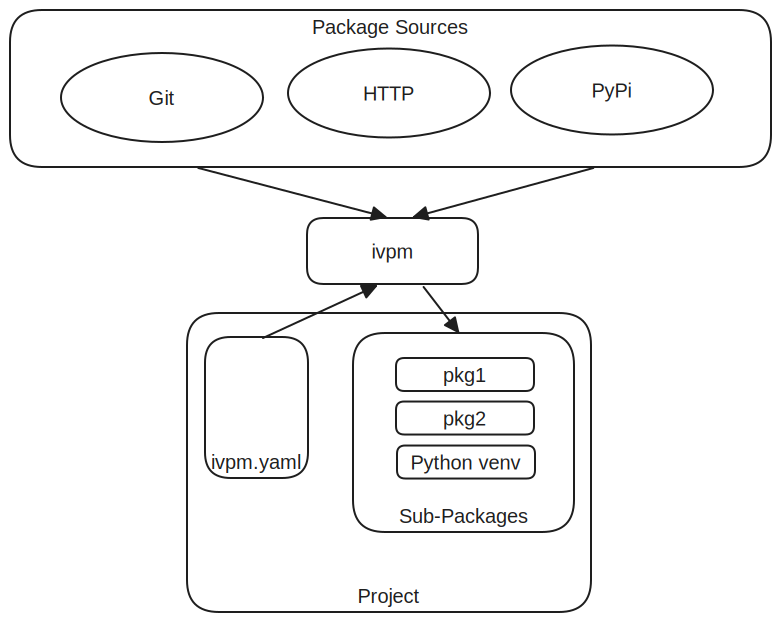

##############
Core Concepts
##############

Understanding IVPM's Core Model
================================

IVPM uses a project-local approach to package management. Unlike system-wide 
package managers, IVPM stores all dependencies within each project, making 
projects self-contained and portable.

Project Structure
=================

A typical IVPM-enabled project has this structure::

    my-project/
    ├── ivpm.yaml                 # Package configuration
    ├── packages/                 # Dependencies directory
    │   ├── python/              # Python virtual environment
    │   ├── dependency-1/        # Source package (editable)
    │   ├── dependency-2/        # Cached package (symlink, read-only)
    │   └── ...
    ├── src/                     # Your project source
    └── ...

Key Concepts
============

Packages
--------

A **package** is a unit of software that your project depends on. Packages can be:

- **Source packages**: Git repositories, local directories
- **Binary packages**: Pre-built archives, PyPI packages
- **Data packages**: Configuration, test data, IP cores

Every package has two key attributes:

1. **Source Type**: How to fetch the package (git, pypi, http, etc.)
2. **Package Type**: What the package contains (python, raw)

Dependencies
------------

**Dependencies** are the packages your project needs. IVPM automatically:

- Fetches missing dependencies
- Resolves sub-dependencies recursively
- Orders installation based on setup requirements
- Handles both development and release dependency profiles

Dependency Sets
---------------

**Dependency sets** are named collections of dependencies. They allow you to:

- Separate development dependencies from release dependencies
- Create different profiles for different build targets
- Control which sub-dependencies get loaded

Common dependency set names:

- ``default`` - Runtime/release dependencies
- ``default-dev`` - Development dependencies (includes tools, test frameworks)
- Custom names - Any profile you define

Example::

    package:
      name: my-project
      default-dep-set: default-dev
      
      dep-sets:
        - name: default
          deps:
            - name: core-lib
              url: https://github.com/org/core-lib.git
        
        - name: default-dev
          deps:
            - name: core-lib
              url: https://github.com/org/core-lib.git
            - name: pytest
              src: pypi
            - name: test-data
              url: https://github.com/org/test-data.git

Recursive Dependency Resolution
================================

IVPM automatically resolves dependencies recursively:

1. Load root project's ``ivpm.yaml``
2. Select the active dependency set
3. For each dependency:
   
   a. Fetch the package source
   b. If the package has ``ivpm.yaml``, resolve its dependencies
   c. Continue recursively for all sub-dependencies

4. Build a complete dependency graph
5. Install packages in the correct order

.. code-block:: text

    Root Project (default-dev)
        ↓
    ├─ Package A (inherits default-dev)
    │   ├─ Sub-package A1
    │   └─ Sub-package A2
    ├─ Package B (uses custom dep-set)
    │   └─ Sub-package B1
    └─ Package C (no sub-dependencies)

Package Types vs Source Types
==============================

Understanding the distinction between **package type** and **source type** is crucial:

Source Type: How to Fetch
--------------------------

The **source type** determines how IVPM obtains the package:

.. list-table::
   :header-rows: 1
   :widths: 20 60 20

   * - Source Type
     - Description
     - Example
   * - ``git``
     - Clone from Git repository
     - GitHub, GitLab
   * - ``pypi``
     - Install from Python Package Index
     - ``requests``, ``numpy``
   * - ``http``
     - Download archive via HTTP/HTTPS
     - ``.tar.gz``, ``.zip``
   * - ``file``
     - Local file
     - ``file:///path/to/archive.tar.gz``
   * - ``dir``
     - Local directory
     - ``file:///path/to/source``
   * - ``gh-rls``
     - GitHub Release asset
     - Platform-specific binaries

Package Type: What It Contains
-------------------------------

The **package type** determines how IVPM processes the package:

.. list-table::
   :header-rows: 1
   :widths: 20 60 20

   * - Package Type
     - Description
     - Install Behavior
   * - ``python``
     - Python package
     - Install into venv (editable or binary)
   * - ``raw``
     - Data/non-Python files
     - Place in packages/ directory only

Auto-Detection
--------------

IVPM automatically detects both types in most cases:

**Source Type Detection:**

- URLs ending in ``.git`` → ``git``
- URLs starting with ``http://`` or ``https://`` → ``http``
- URLs starting with ``file://`` → ``file`` or ``dir``
- No URL specified → ``pypi``

**Package Type Detection:**

- Has ``setup.py``, ``setup.cfg``, or ``pyproject.toml`` → ``python``
- Explicitly ``src: pypi`` → ``python``
- Otherwise → ``raw``

You can explicitly specify types when auto-detection isn't sufficient::

    deps:
      - name: my-package
        url: https://example.com/pkg.tar.gz
        src: http          # Explicitly specify source type
        type: python       # Explicitly specify package type

Project-Local Management
========================

All IVPM operations are project-local:

**Dependencies Directory**

Dependencies are stored in ``packages/`` (configurable via ``deps-dir``)::

    packages/
    ├── python/           # Virtual environment
    │   ├── bin/
    │   ├── lib/
    │   └── ...
    ├── package-a/        # Source dependency
    ├── package-b/        # Source dependency
    └── package-c/        # Link to cache

**Python Virtual Environment**

IVPM creates a project-local Python virtual environment::

    packages/python/
    ├── bin/
    │   ├── python       # Project-specific Python
    │   └── pip
    └── lib/
        └── python3.x/
            └── site-packages/

**Benefits:**

- No system-wide state
- Each project is isolated
- Easy to delete and recreate
- Portable across machines
- Multiple projects can coexist

Working with IVPM
=================

Typical Workflow
----------------

1. **Clone a project**::

    ivpm clone https://github.com/org/project.git

2. **Update dependencies** (done automatically by clone)::

    ivpm update

3. **Activate environment**::

    ivpm activate
    # Or for one command:
    ivpm activate -c "pytest"

4. **Work on code**, make changes

5. **Check status** of Git dependencies::

    ivpm status

6. **Sync** Git dependencies with upstream::

    ivpm sync

Dependency Set Selection
-------------------------

Choose which dependency set to use:

**Via command line:**

.. code-block:: bash

    # Use development dependencies
    ivpm update -d default-dev
    
    # Use release dependencies
    ivpm update -d default

**Via ivpm.yaml:**

.. code-block:: yaml

    package:
      name: my-project
      default-dep-set: default-dev  # Used if no -d specified

**Via sub-package override:**

.. code-block:: yaml

    deps:
      - name: sub-package
        url: https://github.com/org/sub.git
        dep-set: production  # This package uses 'production' dep-set

Next Steps
==========

Now that you understand the core concepts:

- Learn about :doc:`dependency_sets` in detail
- Understand :doc:`package_types` and all available options
- Explore :doc:`caching` for faster updates
- See :doc:`python_packages` for Python-specific features
