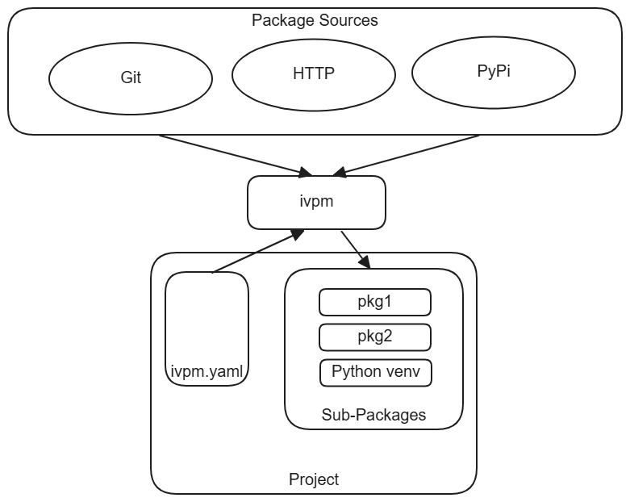

############
Introduction
############

What is IVPM?
==============

IVPM (Integrated View Package Manager) is a project-local, polyglot
package manager.  It fetches dependencies into a ``packages/`` directory
inside your project, processes them through a :doc:`handler pipeline
<handlers>`, and optionally manages a Python virtual environment.  Each
project is fully self-contained -- there is no global state shared between
projects.

Key Capabilities
=================

- **Project-local dependency management** -- all dependencies live inside
  the project.  No system-wide installation, no version conflicts between
  projects.

- **Recursive sub-dependency resolution** -- when a dependency has its own
  ``ivpm.yaml``, IVPM resolves its dependencies automatically.  Dependency
  sets let you control which sub-dependencies are loaded (e.g., dev vs
  release).

- **Python virtual environment management** -- the built-in Python handler
  creates a project-local venv and installs packages via pip or uv.
  Source packages are installed in editable mode for co-development.

- **Git integration** -- ``ivpm status`` and ``ivpm sync`` let you track
  changes, update from upstream, and work with editable Git dependencies.

- **Caching and reproducibility** -- cached packages are shared across
  projects via symlinks.  A lock file records exact resolved versions for
  deterministic reproduction.

- **Extensible handler pipeline** -- each handler builds a unified *view*
  of one facet of the project.  The Python handler builds a virtual
  environment view, the Node handler builds a Node.js environment view,
  the direnv handler builds an environment-variable view, and the agents
  handler builds a skills-directory view.  Third-party handlers can add
  new views via Python entry points.

Where IVPM Fits
================

Unlike pip or conda, IVPM is not a Python-only tool.  It manages
*heterogeneous* dependency trees that mix Python packages with non-Python
assets such as HDL source, data files, pre-built binaries, and
configuration.  Unlike Nix or Bazel, IVPM is lightweight -- a single YAML
file and one command (``ivpm update``) are all you need.

IVPM excels in the **co-development** scenario: when your project's
dependencies are repositories you also contribute to.  Source dependencies
are checked out with full Git history, installed in editable mode, and
manageable via ``ivpm status`` and ``ivpm sync``.

Where pip installs packages and Nix builds environments, IVPM assembles
*views* -- each handler transforms a slice of the dependency graph into a
coherent, domain-specific projection of the project.

Example Domains
================

IVPM originated in hardware verification -- managing SoC designs composed
of Verilog IPs, Bus Functional Models, and Python test frameworks -- but it
is domain-neutral.  Any project that needs a self-contained, reproducible
set of mixed dependencies benefits from IVPM.

**Hardware verification project:**

.. code-block:: yaml

    package:
      name: soc-verification
      default-dep-set: default-dev

      dep-sets:
        - name: default
          deps:
            - name: cpu-core
              url: https://github.com/org/cpu.git
              tag: v1.0

        - name: default-dev
          uses: default
          deps:
            - name: cocotb
              src: pypi
            - name: bus-models
              url: https://github.com/org/bus-models.git

**Pure Python project:**

.. code-block:: yaml

    package:
      name: data-pipeline
      default-dep-set: default-dev

      dep-sets:
        - name: default
          deps:
            - name: pandas
              src: pypi
            - name: numpy
              src: pypi

        - name: default-dev
          uses: default
          deps:
        - name: pytest
          src: pypi

**AI agent project with skills:**

.. code-block:: yaml

    package:
      name: my-agent-workspace
      default-dep-set: default-dev

      with:
        agents:
          claude: true

      dep-sets:
        - name: default-dev
          deps:
            - name: shared-skills
              url: https://github.com/org/shared-skills.git
            - name: langchain
              src: pypi

All three projects share the same structure: an ``ivpm.yaml`` file, a
``packages/`` directory, and the same ``ivpm update`` / ``ivpm activate``
workflow.

Next Steps
===========

- :doc:`getting_started` -- Install IVPM and set up your first project
- :doc:`core_concepts` -- Understand the update pipeline and mental model
